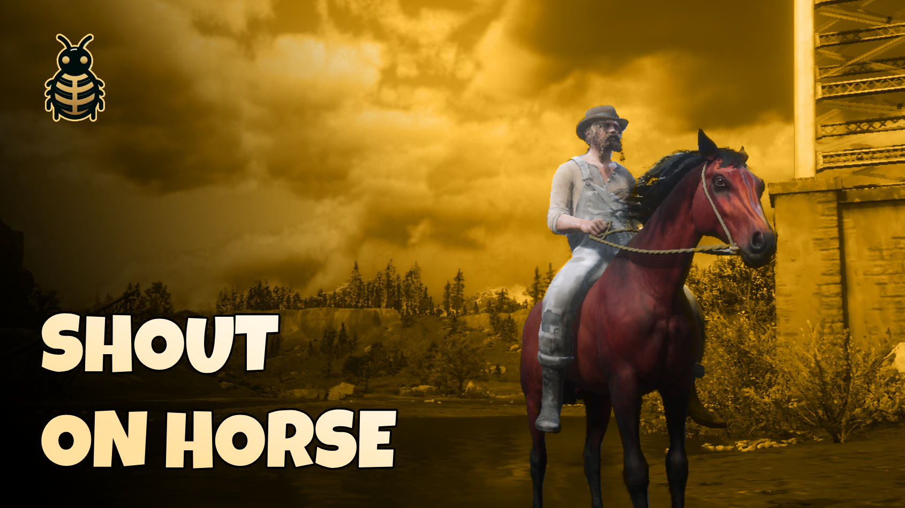

# 🐎 RedM Shout on Horse



Enhance your horse riding experience with immersive voice lines! Your character will naturally react while riding, jumping, and interacting with their horse, just like in the original RDR2 story mode.

[](https://youtu.be/A03P_n8eH7g)
[](https://discord.bln-studio.com/)


## ✨ Features
- Dynamic voice lines when spurring your horse
- Authentic calming voices when patting your horse
- Realistic reactions during horse jumps
- Gender-specific voice lines (male/female characters)
- Smooth voice line transitions with cooldown system
- Network sync - all players can hear your character's reactions
- Uses original RDR2 voice lines
- Realistic event-based detection for horse interactions

## 📥 Installation
1. Download the `bln_horse_shouts` script
2. Place it in your server's `resources` folder
3. Add `ensure bln_horse_shouts` to your `server.cfg`

## 🛠️ Configuration
The script is highly configurable through the `config.lua` file:
```lua
Config = {
    MinTimeBetweenVoices = 5.0,    -- Minimum time between voice lines
    MaxTimeBetweenVoices = 15.0    -- Maximux time between voice lines
    ChanceToSpeak = 85,            -- Percentage chance to trigger voice lines
    
    VoiceLines = {
        male = {
            sprint = {...},         -- Voice lines for spurring
            pat = {...},           -- Voice lines for calming
            jump = {...}           -- Voice lines for jumping
        },
        female = {
            -- Female character voice lines
            ...
        }
    }
}
```

## Support 💬
Need help? Join our Discord server:
[Join Discord](https://discord.com/invite/MEZRYQVpnt)

## Credits 🙏
Created by [BLN Studio](https://bln.tebex.io)
Feel free to contribute to this project! 
